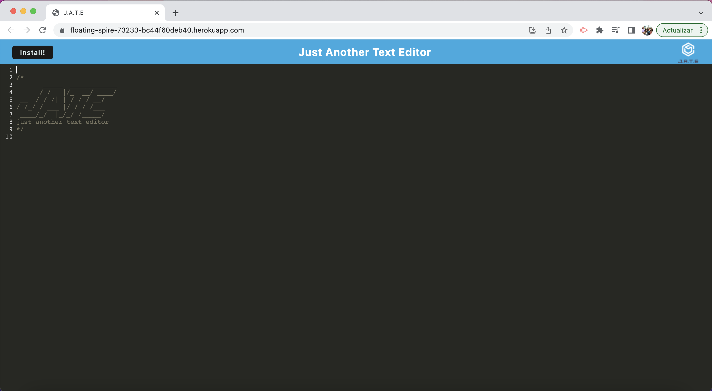

# 19 Progressive Web Applications (PWA): Text Editor

## The Task

This challenge task was to build a text editor that runs in the browser with some conditions: the app is a single-page that meets the PWA criteria, it can be downloades and also runs offline. 

This text editor was build with given starter code and some implement methods were added to store data to a Indexed DB and also to cache information so it can function offline. 

The app is deployed in Heroku. 

## Given User Story

```md
AS A developer
I WANT to create notes or code snippets with or without an internet connection
SO THAT I can reliably retrieve them for later use
```

## Application

The following image shows the application deployed in Heroku: 




## Heroku and GitHub URLs

* [Heroku](https://floating-spire-73233-bc44f60deb40.herokuapp.com/)

* [GitHub](https://github.com/MariaFernandaMarroquin/text-editor-PWA)

- - -
© 2023 edX Boot Camps LLC. Confidential and Proprietary. All Rights Reserved. Developed by María Fernanda Marroquín given starter code. 
